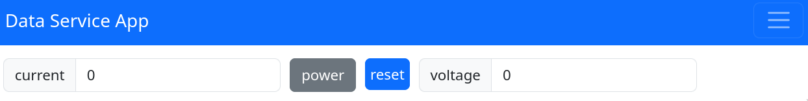

<!--introduction-start-->


[](https://pypi.org/project/pydase/)
[](https://pypi.org/project/pydase/)
[](https://pydase.readthedocs.io/en/stable/)
[][License]
[](https://doi.org/10.5281/zenodo.15703190)

`pydase` is a Python library that simplifies the creation of remote control interfaces for Python objects. It exposes the public attributes of a user-defined class via a [Socket.IO](https://python-socketio.readthedocs.io/en/stable/) web server, ensuring they are always in sync with the service state. You can interact with these attributes using an RPC client, a RESTful API, or a web browser. The web browser frontend is auto-generated, displaying components that correspond to each public attribute of the class for direct interaction.
`pydase` implements an [observer pattern][Observer Pattern] to provide the real-time updates, ensuring that changes to the class attributes are reflected across all clients.

Whether you're managing lab sensors, network devices, or any abstract data entity, `pydase` facilitates service development and deployment.

## Features

<!-- no toc -->
- [Simple service definition through class-based interface][Defining DataService]
- [Auto-generated web interface for interactive access and control of your service][Web Interface Access]
- [Python RPC client][Short RPC Client]
- [Customizable web interface][Customizing Web Interface]
- [Saving and restoring the service state][Service Persistence]
- [Automated task management with built-in start/stop controls and optional autostart][Task Management]
- [Support for units][Units]
- [Validating Property Setters][Property Validation]

<!--introduction-end-->

<!--getting-started-start-->

## Installation


Install `pydase` using [`poetry`](https://python-poetry.org/):

```bash
poetry add pydase
```

or `pip`:

```bash
pip install pydase
```


## Usage


Using `pydase` involves three main steps: defining a `pydase.DataService` subclass, running the server, and then connecting to the service either programmatically using `pydase.Client` or through the web interface.

### Defining a DataService

To use `pydase`, you'll first need to create a class that inherits from `pydase.DataService`.
This class represents your custom service, which will be exposed via a web server.<br>
Your class can implement synchronous and asynchronous methods, some [built-in types](https://docs.python.org/3/library/stdtypes.html) (like `int`, `float`, `str`, `bool`, `list` or `dict`) and [other components][Custom Components] as attributes.
For more information, please refer to the [components guide][Components].

Here's an example:

```python
import pydase
from pydase.utils.decorators import frontend


class Device(pydase.DataService):
    _current = 0.0
    _voltage = 0.0
    _power = False

    @property
    def current(self) -> float:
        # run code to get current
        return self._current

    @current.setter
    def current(self, value: float) -> None:
        # run code to set current
        self._current = value

    @property
    def voltage(self) -> float:
        # run code to get voltage
        return self._voltage

    @voltage.setter
    def voltage(self, value: float) -> None:
        # run code to set voltage
        self._voltage = value

    @property
    def power(self) -> bool:
        # run code to get power state
        return self._power

    @power.setter
    def power(self, value: bool) -> None:
        # run code to set power state
        self._power = value

    @frontend
    def reset(self) -> None:
        self.current = 0.0
        self.voltage = 0.0


if __name__ == "__main__":
    service = Device()
    pydase.Server(service=service, web_port=8001).run()
```

In the above example, we define a `Device` class that inherits from `pydase.DataService`. 
We define a few properties (current, voltage, power) and their getter and setter methods.

### Running the Server

Once your service class is defined, you can create an instance of it and run the server:

```python
import pydase

# ... defining the Device class ...

if __name__ == "__main__":
    service = Device()
    pydase.Server(service=service, web_port=8001).run()
```

This will start the server, making your `Device` service accessible on 
[http://localhost:8001](http://localhost:8001). The port number for the web server can 
be customised in the server constructor or through environment variables and defaults 
to `8001`.

### Accessing the Web Interface

Once the server is running, you can access the web interface in a browser:



In this interface, you can interact with the properties of your `Device` service.

### Connecting to the Service via Python RPC Client

You can connect to the service using the `pydase.Client`. Below is an example of how to establish a connection to a service and interact with it:

```python
import pydase

# Replace the hostname and port with the IP address and the port of the machine where 
# the service is running, respectively
client_proxy = pydase.Client(url="ws://<ip_addr>:<web_port>").proxy
# client_proxy = pydase.Client(url="wss://your-domain.ch").proxy  # if your service uses ssl-encryption

# After the connection, interact with the service attributes as if they were local
client_proxy.voltage = 5.0
print(client_proxy.voltage)  # Expected output: 5.0
```

This example demonstrates setting and retrieving the `voltage` attribute through the client proxy.
The proxy acts as a local representative of the remote service, enabling straightforward interaction.

The proxy class dynamically synchronizes with the server's exposed attributes. This synchronization allows the proxy to be automatically updated with any attributes or methods that the server exposes, essentially mirroring the server's API. This dynamic updating enables users to interact with the remote service as if they were working with a local object.

The RPC client also supports tab completion support in the interpreter, can be used as a context manager and integrates very well with other pydase services. For more information, please refer to the [documentation][Python RPC Client].

### RESTful API
The `pydase` RESTful API allows for standard HTTP-based interactions and provides access to various functionalities through specific routes. 

For example, you can get a value like this:

```python
import json

import requests

response = requests.get(
    "http://<hostname>:<web_port>/api/v1/get_value?access_path=<full_access_path>"
)
serialized_value = json.loads(response.text)
```

For more information, see [here][RESTful API].

<!--getting-started-end-->

## Configuring pydase via Environment Variables

`pydase` services work out of the box without requiring any configuration. However, you
might want to change some options, such as the web server port or logging level. To 
accommodate such customizations, `pydase` allows configuration through environment 
variables, such as:

- **`ENVIRONMENT`**:  
  Defines the operation mode (`"development"` or `"production"`), which influences 
  behaviour such as logging (see [Logging in pydase](#logging-in-pydase)).

- **`SERVICE_CONFIG_DIR`**:  
  Specifies the directory for configuration files (e.g., `web_settings.json`). Defaults
  to the `config` folder in the service root. Access this programmatically using:

    ```python
    import pydase.config
    pydase.config.ServiceConfig().config_dir
    ```

- **`SERVICE_WEB_PORT`**:  
  Defines the web server’s port. Ensure each service on the same host uses a unique 
  port. Default: `8001`.

- **`GENERATE_WEB_SETTINGS`**:  
  When `true`, generates or updates the `web_settings.json` file. Existing entries are 
  preserved, and new entries are appended.

For more information, see [Configuring pydase](https://pydase.readthedocs.io/en/stable/user-guide/Configuration/).

## Customizing the Web Interface

`pydase` allows you to enhance the user experience by customizing the web interface's appearance through

1. a custom CSS file, and
2. a custom favicon image, and
3. tailoring the frontend component layout and display style.

You can also provide a custom frontend source if you need even more flexibility.

For details, please see [here](https://pydase.readthedocs.io/en/stable/user-guide/interaction/main/#customization-options).

## Logging in pydase

The `pydase` library provides structured, per-module logging with support for log level configuration, rich formatting, and optional client identification in logs.

To configure logging in your own service, you can use:

```python
from pydase.utils.logging import configure_logging_with_pydase_formatter
```

For more information, see the [full guide](https://pydase.readthedocs.io/en/stable/user-guide/Logging/).

## Documentation

The full documentation provides more detailed information about `pydase`, including advanced usage examples, API references, and tips for troubleshooting common issues. See the [full documentation](https://pydase.readthedocs.io/en/stable/) for more information.

## Contributing

We welcome contributions! Please see [contributing.md](https://pydase.readthedocs.io/en/stable/about/contributing/) for details on how to contribute.

## Acknowledgements

This work was funded by the [ETH Zurich-PSI Quantum Computing Hub](https://www.psi.ch/en/lnq/qchub).

The main idea behind `pydase` is based on a previous project called `tiqi-plugin`, which
was developed within the same research group. While the concept was inspired by that
project, `pydase` was implemented from the ground up with a new architecture and design.

## License

`pydase` is licensed under the [MIT License][License].

[pydase Banner]: ./docs/images/logo-with-text.png
[License]: ./LICENSE
[Observer Pattern]: https://pydase.readthedocs.io/en/docs/dev-guide/Observer_Pattern_Implementation/
[Service Persistence]: https://pydase.readthedocs.io/en/stable/user-guide/Service_Persistence
[Defining DataService]: #defining-a-dataService
[Web Interface Access]: #accessing-the-web-interface
[Short RPC Client]: #connecting-to-the-service-via-python-rpc-client
[Customizing Web Interface]: #customizing-the-web-interface
[Task Management]: https://pydase.readthedocs.io/en/stable/user-guide/Tasks/
[Units]: https://pydase.readthedocs.io/en/stable/user-guide/Understanding-Units/
[Property Validation]: https://pydase.readthedocs.io/en/stable/user-guide/Validating-Property-Setters/
[Custom Components]: https://pydase.readthedocs.io/en/stable/user-guide/Components/#custom-components-pydasecomponents
[Components]: https://pydase.readthedocs.io/en/stable/user-guide/Components/
[RESTful API]: https://pydase.readthedocs.io/en/stable/user-guide/interaction/main/#restful-api
[Python RPC Client]: https://pydase.readthedocs.io/en/stable/user-guide/interaction/main/#python-rpc-client
