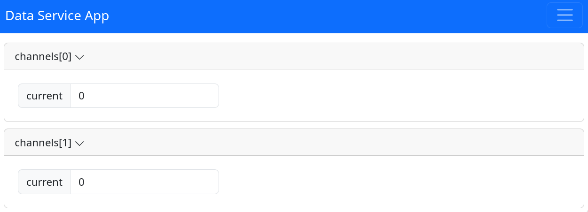
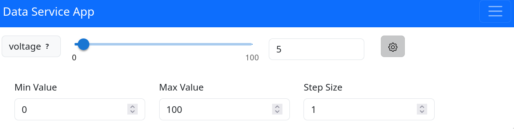
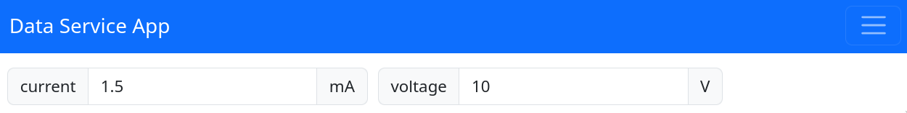

# pydase (Python Data Service) <!-- omit from toc -->

[](https://opensource.org/licenses/MIT)
[](https://pydase.readthedocs.io/en/latest/?badge=latest)

`pydase` is a Python library for creating data service servers with integrated web and RPC servers. It's designed to handle the management of data structures, automated tasks, and callbacks, and provides built-in functionality for serving data over different protocols.

- [Features](#features)
- [Installation](#installation)
- [Usage](#usage)
  - [Defining a DataService](#defining-a-dataservice)
  - [Running the Server](#running-the-server)
  - [Accessing the Web Interface](#accessing-the-web-interface)
  - [Connecting to the Service using rpyc](#connecting-to-the-service-using-rpyc)
- [Understanding the Component System](#understanding-the-component-system)
  - [Built-in Type and Enum Components](#built-in-type-and-enum-components)
  - [Method Components](#method-components)
  - [DataService Instances (Nested Classes)](#dataservice-instances-nested-classes)
  - [Custom Components (`pydase.components`)](#custom-components-pydasecomponents)
    - [`Image`](#image)
    - [`NumberSlider`](#numberslider)
    - [`ColouredEnum`](#colouredenum)
    - [Extending with New Components](#extending-with-new-components)
- [Customizing Web Interface Style](#customizing-web-interface-style)
- [Understanding Service Persistence](#understanding-service-persistence)
  - [Controlling Property State Loading with `@load_state`](#controlling-property-state-loading-with-load_state)
- [Understanding Tasks in pydase](#understanding-tasks-in-pydase)
- [Understanding Units in pydase](#understanding-units-in-pydase)
- [Changing the Log Level](#changing-the-log-level)
- [Documentation](#documentation)
- [Contributing](#contributing)
- [License](#license)

## Features

<!-- no toc -->
- [Simple data service definition through class-based interface](#defining-a-dataService)
- [Integrated web interface for interactive access and control of your data service](#accessing-the-web-interface)
- [Support for `rpyc` connections, allowing for programmatic control and interaction with your service](#connecting-to-the-service-using-rpyc)
- [Component system bridging Python backend with frontend visual representation](#understanding-the-component-system)
- [Customizable styling for the web interface through user-defined CSS](#customizing-web-interface-style)
- [Saving and restoring the service state for service persistence](#understanding-service-persistence)
- [Automated task management with built-in start/stop controls and optional autostart](#understanding-tasks-in-pydase)
- [Support for units](#understanding-units-in-pydase)
<!-- * Event-based callback functionality for real-time updates
- Support for additional servers for specific use-cases -->

## Installation

<!--installation-start-->

Install pydase using [`poetry`](https://python-poetry.org/):

```bash
poetry add pydase
```

or `pip`:

```bash
pip install pydase
```

<!--installation-end-->

## Usage

<!--usage-start-->

Using `pydase` involves three main steps: defining a `DataService` subclass, running the server, and then connecting to the service either programmatically using `rpyc` or through the web interface.

### Defining a DataService

To use pydase, you'll first need to create a class that inherits from `DataService`. This class represents your custom data service, which will be exposed via RPC (using rpyc) and a web server. Your class can implement class / instance attributes and synchronous and asynchronous tasks.

Here's an example:

```python
from pydase import DataService, Server


class Device(DataService):
    _current = 0.0
    _voltage = 0.0
    _power = False

    @property
    def current(self) -> float:
        # run code to get current
        return self._current

    @current.setter
    def current(self, value: float) -> None:
        # run code to set current
        self._current = value

    @property
    def voltage(self) -> float:
        # run code to get voltage
        return self._voltage

    @voltage.setter
    def voltage(self, value: float) -> None:
        # run code to set voltage
        self._voltage = value

    @property
    def power(self) -> bool:
        # run code to get power state
        return self._power

    @power.setter
    def power(self, value: bool) -> None:
        # run code to set power state
        self._power = value

    def reset(self) -> None:
        self.current = 0.0
        self.voltage = 0.0


if __name__ == "__main__":
    service = Device()
    Server(service).run()
```

In the above example, we define a Device class that extends DataService. We define a few properties (current, voltage, power) and their getter and setter methods.

### Running the Server

Once your DataService is defined, you can create an instance of it and run the server:

```python
from pydase import Server

# ... defining the Device class ...

if __name__ == "__main__":
    service = Device()
    Server(service).run()
```

This will start the server, making your Device service accessible via RPC and a web server at [http://localhost:8001](http://localhost:8001).

### Accessing the Web Interface

Once the server is running, you can access the web interface in a browser:


In this interface, you can interact with the properties of your `Device` service.

### Connecting to the Service using rpyc

You can also connect to the service using `rpyc`. Here's an example on how to establish a connection and interact with the service:

```python
import rpyc

# Connect to the service
conn = rpyc.connect("<ip_addr>", 18871)
client = conn.root

# Interact with the service
client.voltage = 5.0
print(client.voltage)  # prints 5.0
```

In this example, replace `<ip_addr>` with the IP address of the machine where the service is running. After establishing a connection, you can interact with the service attributes as if they were local attributes.

<!--usage-end-->

## Understanding the Component System

<!-- Component User Guide Start -->

In `pydase`, components are fundamental building blocks that bridge the Python backend logic with frontend visual representation and interactions. This system can be understood based on the following categories:

### Built-in Type and Enum Components

`pydase` automatically maps standard Python data types to their corresponding frontend components:

- `str`: Translated into a `StringComponent` on the frontend.
- `int` and `float`: Manifested as the `NumberComponent`.
- `bool`: Rendered as a `ButtonComponent`.
- `list`: Each item displayed individually, named after the list attribute and its index.
- `enum.Enum`: Presented as an `EnumComponent`, facilitating dropdown selection.

### Method Components

Methods within the `DataService` class have frontend representations:

- Regular Methods: These are rendered as a `MethodComponent` in the frontend, allowing users to execute the method via an "execute" button.
- Asynchronous Methods: These are manifested as the `AsyncMethodComponent` with "start"/"stop" buttons to manage the execution of [tasks](#understanding-tasks-in-pydase).

### DataService Instances (Nested Classes)

Nested `DataService` instances offer an organized hierarchy for components, enabling richer applications. Each nested class might have its own attributes and methods, each mapped to a frontend component.

Here is an example:

```python
from pydase import DataService, Server


class Channel(DataService):
    def __init__(self, channel_id: int) -> None:
        self._channel_id = channel_id
        self._current = 0.0
        super().__init__()

    @property
    def current(self) -> float:
        # run code to get current
        result = self._current
        return result

    @current.setter
    def current(self, value: float) -> None:
        # run code to set current
        self._current = value


class Device(DataService):
    def __init__(self) -> None:
        self.channels = [Channel(i) for i in range(2)]

        super().__init__()


if __name__ == "__main__":
    service = Device()
    Server(service).run()
```



**Note** that defining classes within `DataService` classes is not supported (see [this issue](https://github.com/tiqi-group/pydase/issues/16)).

### Custom Components (`pydase.components`)

The custom components in `pydase` have two main parts:

- A **Python Component Class** in the backend, implementing the logic needed to set, update, and manage the component's state and data.
- A **Frontend React Component** that renders and manages user interaction in the browser.

Below are the components available in the `pydase.components` module, accompanied by their Python usage:

#### `Image`

This component provides a versatile interface for displaying images within the application. Users can update and manage images from various sources, including local paths, URLs, and even matplotlib figures.

The component offers methods to load images seamlessly, ensuring that visual content is easily integrated and displayed within the data service.

```python
import matplotlib.pyplot as plt
import numpy as np

import pydase
from pydase.components.image import Image


class MyDataService(pydase.DataService):
    my_image = Image()


if __name__ == "__main__":
    service = MyDataService()
    # loading from local path
    service.my_image.load_from_path("/your/image/path/")

    # loading from a URL
    service.my_image.load_from_url("https://cataas.com/cat")

    # loading a matplotlib figure
    fig = plt.figure()
    x = np.linspace(0, 2 * np.pi)
    plt.plot(x, np.sin(x))
    plt.grid()
    service.my_image.load_from_matplotlib_figure(fig)

    pydase.Server(service).run()
```


#### `NumberSlider`

This component provides an interactive slider interface for adjusting numerical values on the frontend. It supports both floats and integers. The values adjusted on the frontend are synchronized with the backend in real-time, ensuring consistent data representation.

The slider can be customized with initial values, minimum and maximum limits, and step sizes to fit various use cases.

```python
import pydase
from pydase.components import NumberSlider


class MyService(pydase.DataService):
    slider = NumberSlider(value=3.5, min=0, max=10, step_size=0.1, type="float")


if __name__ == "__main__":
    service = MyService()
    pydase.Server(service).run()
```



#### `ColouredEnum`

This component provides a way to visually represent different states or categories in a data service using colour-coded options. It behaves similarly to a standard `Enum`, but the values encode colours in a format understood by CSS. The colours can be defined using various methods like Hexadecimal, RGB, HSL, and more.

If the property associated with the `ColouredEnum` has a setter function, the keys of the enum will be rendered as a dropdown menu, allowing users to interact and select different options. Without a setter function, the selected key will simply be displayed as a coloured box with text inside, serving as a visual indicator.

```python
import pydase
import pydase.components as pyc


class MyStatus(pyc.ColouredEnum):
    PENDING = "#FFA500"  # Hexadecimal colour (Orange)
    RUNNING = "#0000FF80"  # Hexadecimal colour with transparency (Blue)
    PAUSED = "rgb(169, 169, 169)"  # RGB colour (Dark Gray)
    RETRYING = "rgba(255, 255, 0, 0.3)"  # RGB colour with transparency (Yellow)
    COMPLETED = "hsl(120, 100%, 50%)"  # HSL colour (Green)
    FAILED = "hsla(0, 100%, 50%, 0.7)"  # HSL colour with transparency (Red)
    CANCELLED = "SlateGray"  # Cross-browser colour name (Slate Gray)


class StatusTest(pydase.DataService):
    _status = MyStatus.RUNNING

    @property
    def status(self) -> MyStatus:
        return self._status

    @status.setter
    def status(self, value: MyStatus) -> None:
        # do something ...
        self._status = value

# Modifying or accessing the status value:
my_service = StatusExample()
my_service.status = MyStatus.FAILED
```


#### Extending with New Components

Users can also extend the library by creating custom components. This involves defining the behavior on the Python backend and the visual representation on the frontend. For those looking to introduce new components, the [guide on adding components](https://pydase.readthedocs.io/en/latest/dev-guide/Adding_Components/) provides detailed steps on achieving this.

<!-- Component User Guide End -->

## Customizing Web Interface Style

`pydase` allows you to enhance the user experience by customizing the web interface's appearance. You can apply your own styles globally across the web interface by passing a custom CSS file to the server during initialization.

Here's how you can use this feature:

1. Prepare your custom CSS file with the desired styles.

2. When initializing your server, use the `css` parameter of the `Server` class to specify the path to your custom CSS file.

```python
from pydase import Server, DataService

class Device(DataService):
    # ... your service definition ...

if __name__ == "__main__":
    service = MyService()
    server = Server(service, css="path/to/your/custom.css").run()
```

This will apply the styles defined in `custom.css` to the web interface, allowing you to maintain branding consistency or improve visual accessibility.

Please ensure that the CSS file path is accessible from the server's running location. Relative or absolute paths can be used depending on your setup.

## Understanding Service Persistence

`pydase` allows you to easily persist the state of your service by saving it to a file. This is especially useful when you want to maintain the service's state across different runs.

To save the state of your service, pass a `filename` keyword argument to the constructor of the `pydase.Server` class. If the file specified by `filename` does not exist, the state manager will create this file and store its state in it when the service is shut down. If the file already exists, the state manager will load the state from this file, setting the values of its attributes to the values stored in the file.

Here's an example:

```python
from pydase import DataService, Server

class Device(DataService):
    # ... defining the Device class ...


if __name__ == "__main__":
    service = Device()
    Server(service, filename="device_state.json").run()
```

In this example, the state of the `Device` service will be saved to `device_state.json` when the service is shut down. If `device_state.json` exists when the server is started, the state manager will restore the state of the service from this file.

### Controlling Property State Loading with `@load_state`

By default, the state manager only restores values for public attributes of your service. If you have properties that you want to control the loading for, you can use the `@load_state` decorator on your property setters. This indicates to the state manager that the value of the property should be loaded from the state file.

Here is how you can apply the `@load_state` decorator:

```python
from pydase import DataService
from pydase.data_service.state_manager import load_state

class Device(DataService):
    _name = "Default Device Name"

    @property
    def name(self) -> str:
        return self._name

    @name.setter
    @load_state
    def name(self, value: str) -> None:
        self._name = value
```

With the `@load_state` decorator applied to the `name` property setter, the state manager will load and apply the `name` property's value from the file storing the state upon server startup, assuming it exists.

Note: If the service class structure has changed since the last time its state was saved, only the attributes and properties decorated with `@load_state` that have remained the same will be restored from the settings file.

## Understanding Tasks in pydase

In `pydase`, a task is defined as an asynchronous function contained in a class that inherits from `DataService`. These tasks usually contain a while loop and are designed to carry out periodic functions.

For example, a task might be used to periodically read sensor data, update a database, or perform any other recurring job. The core feature of `pydase` is its ability to automatically generate start and stop functions for these tasks. This allows you to control task execution via both the frontend and an `rpyc` client, giving you flexible and powerful control over your service's operation.

Another powerful feature of `pydase` is its ability to automatically start tasks upon initialization of the service. By specifying the tasks and their arguments in the `_autostart_tasks` dictionary in your service class's `__init__` method, `pydase` will automatically start these tasks when the server is started. Here's an example:

```python
from pydase import DataService, Server

class SensorService(DataService):
    def __init__(self):
        self.readout_frequency = 1.0
        self._autostart_tasks = {"read_sensor_data": ()}  # args passed to the function go there
        super().__init__()

    def _process_data(self, data: ...) -> None:
        ...

    def _read_from_sensor(self) -> Any:
        ...

    async def read_sensor_data(self):
        while True:
            data = self._read_from_sensor()
            self._process_data(data)  # Process the data as needed
            await asyncio.sleep(self.readout_frequency)


if __name__ == "__main__":
    service = SensorService()
    Server(service).run()
```

In this example, `read_sensor_data` is a task that continuously reads data from a sensor. The readout frequency can be updated using the `readout_frequency` attribute.
By listing it in the `_autostart_tasks` dictionary, it will automatically start running when `Server(service).run()` is executed.
As with all tasks, `pydase` will also generate `start_read_sensor_data` and `stop_read_sensor_data` methods, which can be called to manually start and stop the data reading task.

## Understanding Units in pydase

`pydase` integrates with the [`pint`](https://pint.readthedocs.io/en/stable/) package to allow you to work with physical quantities within your service. This enables you to define attributes with units, making your service more expressive and ensuring consistency in the handling of physical quantities.

You can define quantities in your `DataService` subclass using `pydase`'s `units` functionality. These quantities can be set and accessed like regular attributes, and `pydase` will automatically handle the conversion between floats and quantities with units.

Here's an example:

```python
from typing import Any
from pydase import DataService, Server
import pydase.units as u


class ServiceClass(DataService):
    voltage = 1.0 * u.units.V
    _current: u.Quantity = 1.0 * u.units.mA

    @property
    def current(self) -> u.Quantity:
        return self._current

    @current.setter
    def current(self, value: Any) -> None:
        self._current = value


if __name__ == "__main__":
    service = ServiceClass()

    # You can just set floats to the Quantity objects. The DataService __setattr__ will
    # automatically convert this
    service.voltage = 10.0
    service.current = 1.5

    Server(service).run()
```

In the frontend, quantities are rendered as floats, with the unit displayed as additional text. This allows you to maintain a clear and consistent representation of physical quantities across both the backend and frontend of your service.


Should you need to access the magnitude or the unit of a quantity, you can use the `.m` attribute or the `.u` attribute of the variable, respectively. For example, this could be necessary to set the periodicity of a task:

```python
import asyncio
from pydase import DataService, Server
import pydase.units as u


class ServiceClass(DataService):
    readout_wait_time = 1.0 * u.units.ms

    async def read_sensor_data(self):
        while True:
            print("Reading out sensor ...")
            await asyncio.sleep(self.readout_wait_time.to("s").m)


if __name__ == "__main__":
    service = ServiceClass()

    Server(service).run()
```

For more information about what you can do with the units, please consult the documentation of [`pint`](https://pint.readthedocs.io/en/stable/).

## Logging in pydase

The `pydase` library organizes its loggers on a per-module basis, mirroring the Python package hierarchy. This structured approach allows for granular control over logging levels and behaviour across different parts of the library.

### Changing the Log Level

You have two primary ways to adjust the log levels in `pydase`:

1. directly targeting `pydase` loggers

   You can set the log level for any `pydase` logger directly in your code. This method is useful for fine-tuning logging levels for specific modules within `pydase`. For instance, if you want to change the log level of the main `pydase` logger or target a submodule like `pydase.data_service`, you can do so as follows:
 
   ```python
   # <your_script.py>
   import logging
 
   # Set the log level for the main pydase logger
   logging.getLogger("pydase").setLevel(logging.INFO)
 
   # Optionally, target a specific submodule logger
   # logging.getLogger("pydase.data_service").setLevel(logging.DEBUG)
 
   # Your logger for the current script
   logger = logging.getLogger(__name__)
   logger.info("My info message.")
   ```
 
   This approach allows for specific control over different parts of the `pydase` library, depending on your logging needs.

2. using the `ENVIRONMENT` environment variable

   For a more global setting that affects the entire `pydase` library, you can utilize the `ENVIRONMENT` environment variable. Setting this variable to "production" will configure all `pydase` loggers to only log messages of level "INFO" and above, filtering out more verbose logging. This is particularly useful for production environments where excessive logging can be overwhelming or unnecessary.
 
   ```bash
   ENVIRONMENT="production" python -m <module_using_pydase>
   ```
 
   In the absence of this setting, the default behavior is to log everything of level "DEBUG" and above, suitable for development environments where more detailed logs are beneficial.
 
**Note**: It is recommended to avoid calling the `pydase.utils.logging.setup_logging` function directly, as this may result in duplicated logging messages.

## Documentation

The full documentation provides more detailed information about `pydase`, including advanced usage examples, API references, and tips for troubleshooting common issues. See the [full documentation](https://pydase.readthedocs.io/en/latest/) for more information.

## Contributing

We welcome contributions! Please see [contributing.md](https://pydase.readthedocs.io/en/latest/about/contributing/) for details on how to contribute.

## License

`pydase` is licensed under the [MIT License](https://github.com/tiqi-group/pydase/blob/main/LICENSE).
