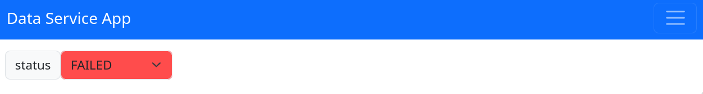

# Components Guide

In `pydase`, components are fundamental building blocks that bridge the Python backend logic with frontend visual representation and interactions. This system can be understood based on the following categories:

## Built-in Type and Enum Components

`pydase` automatically maps standard Python data types to their corresponding frontend components:

- `str`: Translated into a `StringComponent` on the frontend.
- `int` and `float`: Manifested as the `NumberComponent`.
- `bool`: Rendered as a `ButtonComponent`.
- `list`: Each item displayed individually, named after the list attribute and its index.
- `dict`: Each key-value pair displayed individually, named after the dictionary attribute and its key. **Note** that the dictionary keys must be strings.
- `enum.Enum`: Presented as an `EnumComponent`, facilitating dropdown selection.

## Method Components
Within the `DataService` class of `pydase`, only methods devoid of arguments can be represented in the frontend, classified into two distinct categories

1. [**Tasks**](./Tasks.md): Argument-free asynchronous functions, identified within `pydase` as tasks, are inherently designed for frontend interaction. These tasks are automatically rendered with a start/stop button, allowing users to initiate or halt the task execution directly from the web interface. 
2. **Synchronous Methods with `@frontend` Decorator**: Synchronous methods without arguments can also be presented in the frontend. For this, they have to be decorated with the `@frontend` decorator.

```python
import pydase
import pydase.components
import pydase.units as u
from pydase.utils.decorators import frontend


class MyService(pydase.DataService):
    @frontend
    def exposed_method(self) -> None:
        ...

    async def my_task(self) -> None:
        while True:
            # ...
```


You can still define synchronous tasks with arguments and call them using a python client. However, decorating them with the `@frontend` decorator will raise a `FunctionDefinitionError`. Defining a task with arguments will raise a `TaskDefinitionError`.
I decided against supporting function arguments for functions rendered in the frontend due to the following reasons:

1. Feature Request Pitfall: supporting function arguments create a bottomless pit of feature requests. As users encounter the limitations of supported types, demands for extending support to more complex types would grow.
2. Complexity in Supported Argument Types: while simple types like `int`, `float`, `bool` and `str` could be easily supported, more complicated types are not (representation, (de-)serialization).

## DataService Instances (Nested Classes)

Nested `DataService` instances offer an organized hierarchy for components, enabling richer applications. Each nested class might have its own attributes and methods, each mapped to a frontend component.

Here is an example:

```python
from pydase import DataService, Server


class Channel(DataService):
    def __init__(self, channel_id: int) -> None:
        super().__init__()
        self._channel_id = channel_id
        self._current = 0.0

    @property
    def current(self) -> float:
        # run code to get current
        result = self._current
        return result

    @current.setter
    def current(self, value: float) -> None:
        # run code to set current
        self._current = value


class Device(DataService):
    def __init__(self) -> None:
        super().__init__()
        self.channels = [Channel(i) for i in range(2)]


if __name__ == "__main__":
    service = Device()
    Server(service).run()
```


**Note** that defining classes within `DataService` classes is not supported (see [this issue](https://github.com/tiqi-group/pydase/issues/16)).

## Custom Components (`pydase.components`)

The custom components in `pydase` have two main parts:

- A **Python Component Class** in the backend, implementing the logic needed to set, update, and manage the component's state and data.
- A **Frontend React Component** that renders and manages user interaction in the browser.

Below are the components available in the `pydase.components` module, accompanied by their Python usage:

### `DeviceConnection`

The `DeviceConnection` component acts as a base class within the `pydase` framework for managing device connections. It provides a structured approach to handle connections by offering a customizable `connect` method and a `connected` property. This setup facilitates the implementation of automatic reconnection logic, which periodically attempts reconnection whenever the connection is lost.

In the frontend, this class abstracts away the direct interaction with the `connect` method and the `connected` property. Instead, it showcases user-defined attributes, methods, and properties. When the `connected` status is `False`, the frontend displays an overlay that prompts manual reconnection through the `connect()` method. Successful reconnection removes the overlay.

```python
import pydase.components
import pydase.units as u


class Device(pydase.components.DeviceConnection):
    def __init__(self) -> None:
        super().__init__()
        self._voltage = 10 * u.units.V

    def connect(self) -> None:
        if not self._connected:
            self._connected = True

    @property
    def voltage(self) -> float:
        return self._voltage


class MyService(pydase.DataService):
    def __init__(self) -> None:
        super().__init__()
        self.device = Device()


if __name__ == "__main__":
    service_instance = MyService()
    pydase.Server(service_instance).run()
```


#### Customizing Connection Logic

Users are encouraged to primarily override the `connect` method to tailor the connection process to their specific device. This method should adjust the `self._connected` attribute based on the outcome of the connection attempt:

```python
import pydase.components


class MyDeviceConnection(pydase.components.DeviceConnection):
    def __init__(self) -> None:
        super().__init__()
        # Add any necessary initialization code here

    def connect(self) -> None:
        # Implement device-specific connection logic here
        # Update self._connected to `True` if the connection is successful,
        # or `False` if unsuccessful
        ...
```

Moreover, if the connection status requires additional logic, users can override the `connected` property:

```python
import pydase.components

class MyDeviceConnection(pydase.components.DeviceConnection):
    def __init__(self) -> None:
        super().__init__()
        # Add any necessary initialization code here

    def connect(self) -> None:
        # Implement device-specific connection logic here
        # Ensure self._connected reflects the connection status accurately
        ...

    @property
    def connected(self) -> bool:
        # Implement custom logic to accurately report connection status
        return self._connected
```

#### Reconnection Interval

The `DeviceConnection` component automatically executes a task that checks for device availability at a default interval of 10 seconds. This interval is adjustable by modifying the `_reconnection_wait_time` attribute on the class instance.

### `Image`

This component provides a versatile interface for displaying images within the application. Users can update and manage images from various sources, including local paths, URLs, and even matplotlib figures.

The component offers methods to load images seamlessly, ensuring that visual content is easily integrated and displayed within the data service.

```python
import matplotlib.pyplot as plt
import numpy as np
import pydase
from pydase.components.image import Image


class MyDataService(pydase.DataService):
    my_image = Image()


if __name__ == "__main__":
    service = MyDataService()
    # loading from local path
    service.my_image.load_from_path("/your/image/path/")

    # loading from a URL
    service.my_image.load_from_url("https://cataas.com/cat")

    # loading a matplotlib figure
    fig = plt.figure()
    x = np.linspace(0, 2 * np.pi)
    plt.plot(x, np.sin(x))
    plt.grid()
    service.my_image.load_from_matplotlib_figure(fig)

    pydase.Server(service).run()
```


### `NumberSlider`

The `NumberSlider` component in the `pydase` package provides an interactive slider interface for adjusting numerical values on the frontend. It is designed to support both numbers and quantities and ensures that values adjusted on the frontend are synchronized with the backend.

To utilize the `NumberSlider`, users should implement a class that derives from `NumberSlider`. This class can then define the initial values, minimum and maximum limits, step sizes, and additional logic as needed.

Here's an example of how to implement and use a custom slider:

```python
import pydase
import pydase.components


class MySlider(pydase.components.NumberSlider):
    def __init__(
        self,
        value: float = 0.0,
        min_: float = 0.0,
        max_: float = 100.0,
        step_size: float = 1.0,
    ) -> None:
        super().__init__(value, min_, max_, step_size)

    @property
    def min(self) -> float:
        return self._min

    @min.setter
    def min(self, value: float) -> None:
        self._min = value

    @property
    def max(self) -> float:
        return self._max

    @max.setter
    def max(self, value: float) -> None:
        self._max = value

    @property
    def step_size(self) -> float:
        return self._step_size

    @step_size.setter
    def step_size(self, value: float) -> None:
        self._step_size = value

    @property
    def value(self) -> float:
        """Slider value."""
        return self._value

    @value.setter
    def value(self, value: float) -> None:
        if value < self._min or value > self._max:
            raise ValueError("Value is either below allowed min or above max value.")

        self._value = value


class MyService(pydase.DataService):
    def __init__(self) -> None:
        super().__init__()
        self.voltage = MySlider()


if __name__ == "__main__":
    service_instance = MyService()
    service_instance.voltage.value = 5
    print(service_instance.voltage.value)  # Output: 5
    pydase.Server(service_instance).run()
```

In this example, `MySlider` overrides the `min`, `max`, `step_size`, and `value` properties. Users can make any of these properties read-only by omitting the corresponding setter method.


- Accessing parent class resources in `NumberSlider`

    In scenarios where you need the slider component to interact with or access resources from its parent class, you can achieve this by passing a callback function to it. This method avoids directly passing the entire parent class instance (`self`) and offers a more encapsulated approach. The callback function can be designed to utilize specific attributes or methods of the parent class, allowing the slider to perform actions or retrieve data in response to slider events.

    Here's an illustrative example:

    ```python
    from collections.abc import Callable

    import pydase
    import pydase.components


    class MySlider(pydase.components.NumberSlider):
        def __init__(
            self,
            value: float,
            on_change: Callable[[float], None],
        ) -> None:
            super().__init__(value=value)
            self._on_change = on_change

        # ... other properties ...

        @property
        def value(self) -> float:
            return self._value

        @value.setter
        def value(self, new_value: float) -> None:
            if new_value < self._min or new_value > self._max:
                raise ValueError("Value is either below allowed min or above max value.")
            self._value = new_value
            self._on_change(new_value)


    class MyService(pydase.DataService):
        def __init__(self) -> None:
            self.voltage = MySlider(
                5,
                on_change=self.handle_voltage_change,
            )

        def handle_voltage_change(self, new_voltage: float) -> None:
            print(f"Voltage changed to: {new_voltage}")
            # Additional logic here

    if __name__ == "__main__":
       service_instance = MyService()
       my_service.voltage.value = 7  # Output: "Voltage changed to: 7"
       pydase.Server(service_instance).run()
    ```

- Incorporating units in `NumberSlider`

    The `NumberSlider` is capable of [displaying units](./Understanding-Units.md) alongside values, enhancing its usability in contexts where unit representation is crucial. When utilizing `pydase.units`, you can specify units for the slider's value, allowing the component to reflect these units in the frontend.

    Here's how to implement a `NumberSlider` with unit display:

    ```python
    import pydase
    import pydase.components
    import pydase.units as u

    class MySlider(pydase.components.NumberSlider):
        def __init__(
            self,
            value: u.Quantity = 0.0 * u.units.V,
        ) -> None:
            super().__init__(value)

        @property
        def value(self) -> u.Quantity:
            return self._value

        @value.setter
        def value(self, value: u.Quantity) -> None:
            if value.m < self._min or value.m > self._max:
                raise ValueError("Value is either below allowed min or above max value.")
            self._value = value

    class MyService(pydase.DataService):
        def __init__(self) -> None:
            super().__init__()
            self.voltage = MySlider()

    if __name__ == "__main__":
        service_instance = MyService()
        service_instance.voltage.value = 5 * u.units.V
        print(service_instance.voltage.value)  # Output: 5 V
        pydase.Server(service_instance).run()
    ```

### `ColouredEnum`

This component provides a way to visually represent different states or categories in a data service using colour-coded options. It behaves similarly to a standard `Enum`, but the values encode colours in a format understood by CSS. The colours can be defined using various methods like Hexadecimal, RGB, HSL, and more.

If the property associated with the `ColouredEnum` has a setter function, the keys of the enum will be rendered as a dropdown menu, allowing users to interact and select different options. Without a setter function, the selected key will simply be displayed as a coloured box with text inside, serving as a visual indicator.

```python
import pydase
import pydase.components as pyc


class MyStatus(pyc.ColouredEnum):
    PENDING = "#FFA500"  # Hexadecimal colour (Orange)
    RUNNING = "#0000FF80"  # Hexadecimal colour with transparency (Blue)
    PAUSED = "rgb(169, 169, 169)"  # RGB colour (Dark Gray)
    RETRYING = "rgba(255, 255, 0, 0.3)"  # RGB colour with transparency (Yellow)
    COMPLETED = "hsl(120, 100%, 50%)"  # HSL colour (Green)
    FAILED = "hsla(0, 100%, 50%, 0.7)"  # HSL colour with transparency (Red)
    CANCELLED = "SlateGray"  # Cross-browser colour name (Slate Gray)


class StatusTest(pydase.DataService):
    _status = MyStatus.RUNNING

    @property
    def status(self) -> MyStatus:
        return self._status

    @status.setter
    def status(self, value: MyStatus) -> None:
        # do something ...
        self._status = value

# Modifying or accessing the status value:
my_service = StatusExample()
my_service.status = MyStatus.FAILED
```



**Note** that each enumeration name and value must be unique.
This means that you should use different colour formats when you want to use a colour multiple times.

### Extending with New Components

Users can also extend the library by creating custom components. This involves defining the behavior on the Python backend and the visual representation on the frontend. For those looking to introduce new components, the [guide on adding components](https://pydase.readthedocs.io/en/latest/dev-guide/Adding_Components/) provides detailed steps on achieving this.

