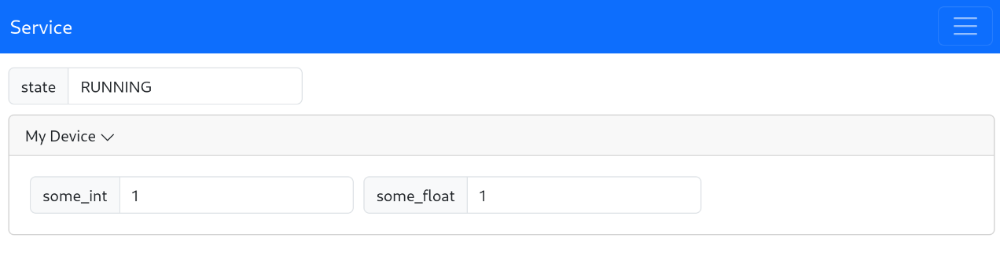

# Auto-generated Frontend

`pydase` automatically generates a frontend interface based on your service definition, representing the current state and controls of the service.
It simplifies the process of visualization and control of the data and devices managed by your `pydase` service, making it accessible to both developers and end-users.

Through the integration of Socket.IO, the frontend provides real-time updates, reflecting changes as they occur and allowing for immediate interaction with the backend.


## Accessing the Frontend

You can access the auto-generated frontend by navigating to the hostname of the device the service is hosted on, followed by the exposed port:

```
http://<hostname>:<port>/
```

The frontend uses a component-based approach, representing various data types and control mechanisms as distinct UI components. For more information about this, please refer to [Components Guide](../Components.md).

## Customization Options

`pydase` allows you to enhance the user experience by customizing the web interface's appearance through

1. a custom CSS file, and
2. tailoring the frontend component layout and display style.

For more advanced customization, you can provide a completely custom frontend source.

### Custom CSS Styling

You can apply your own styles globally across the web interface by passing a custom CSS file to the server during initialization.
Here's how you can use this feature:

1. Prepare your custom CSS file with the desired styles.

2. When initializing your server, use the `css` parameter of the `Server` class to specify the path to your custom CSS file.

```python
from pydase import Server, DataService


class MyService(DataService):
    # ... your service definition ...


if __name__ == "__main__":
    service = MyService()
    server = Server(service, css="path/to/your/custom.css").run()
```

This will apply the styles defined in `custom.css` to the web interface, allowing you to maintain branding consistency or improve visual accessibility.

Please ensure that the CSS file path is accessible from the server's running location. Relative or absolute paths can be used depending on your setup.

### Tailoring Frontend Component Layout

You can customize the display names, visibility, and order of components via the `web_settings.json` file.
Each key in the file corresponds to the full access path of public attributes, properties, and methods of the exposed service, using dot-notation.

- **Custom Display Names**: Modify the `"displayName"` value in the file to change how each component appears in the frontend.
- **Control Component Visibility**: Utilize the `"display"` key-value pair to control whether a component is rendered in the frontend. Set the value to `true` to make the component visible or `false` to hide it.
- **Adjustable Component Order**: The `"displayOrder"` values determine the order of components. Alter these values to rearrange the components as desired. The value defaults to [`Number.MAX_SAFE_INTEGER`](https://developer.mozilla.org/en-US/docs/Web/JavaScript/Reference/Global_Objects/Number/MAX_SAFE_INTEGER).

The `web_settings.json` file will be stored in the directory specified by `SERVICE_CONFIG_DIR`. You can generate a `web_settings.json` file by setting the `GENERATE_WEB_SETTINGS` to `True`. For more information, see the [configuration section](#configuring-pydase-via-environment-variables).

For example, styling the following service 

```python
import pydase


class Device(pydase.DataService):
    name = "My Device"
    temperature = 1.0
    power = 1


class Service(pydase.DataService):
    device = Device()
    state = "RUNNING"


if __name__ == "__main__":
    pydase.Server(Service()).run()
```

with the following `web_settings.json`

```json
{
    "device": {
        "displayName": "My Device",
        "displayOrder": 1
    },
    "device.name": {
        "display": false
    },
    "device.power": {
        "displayName": "Power",
        "displayOrder": 1
    },
    "device.temperature": {
      "displayName": "Temperature",
      "displayOrder": 0
    },
    "state": {
        "displayOrder": 0
    }
}
```

looks like this:



### Specifying a Custom Frontend Source

To further customize your web interface, you can provide a custom frontend source.
By specifying the `frontend_src` parameter when initializing the server, you can host a tailored frontend application:

```python
from pathlib import Path

import pydase


class MyService(pydase.DataService):
    # Service definition


if __name__ == "__main__":
    service = MyService()
    pydase.Server(
        service,
        frontend_src=Path("path/to/your/frontend/directory"),
    ).run()
```

`pydase` expects a directory structured as follows:

```bash  title="Frontend directory structure"
<your_frontend_directory>
├── assets
│   └── ...
└── index.html
```

Any CSS, js, image or other files need to be put into the assets folder for the web server to be able to provide access to it.

#### Example: Custom React Frontend

You can use vite to generate a react app template:

```bash
npm create vite@latest my-react-app -- --template react
```

*TODO: Add some useful information here...*

To deploy the custom react frontend, build it with

```bash
npm run build
```

and pass the relative path of the output directory to the `frontend_src` parameter of the `pydase.Server`.

**Note** that you have to make sure that all the generated files (except the `index.html`) are in the `assets` folder. In the react app, you can achieve this by not using the `public` folder, but instead using e.g. `src/assets`.
